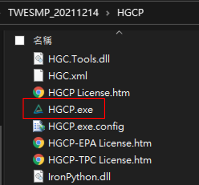

Usage
=====

.. _installation:

Installation
------------

1. To lunch ``SiteManagement``, first install is extract .zip file to any location 
2. Double click “HGCP.exe” under HGCP folder
3. Click “Project” > New/Load a Project
4. Click “Site Manegement” button in the side toolbar

Creating recipes
----------------

To retrieve a list of random ingredients,
you can use the ``lumache.get_random_ingredients()`` function:

.. autofunction:: lumache.get_random_ingredients

The ``kind`` parameter should be either ``"meat"``, ``"fish"``,
or ``"veggies"``. Otherwise, :py:func:`lumache.get_random_ingredients`
will raise an exception.

.. autoexception:: lumache.InvalidKindError

For example:

>>> import lumache
>>> lumache.get_random_ingredients()
['shells', 'gorgonzola', 'parsley']

